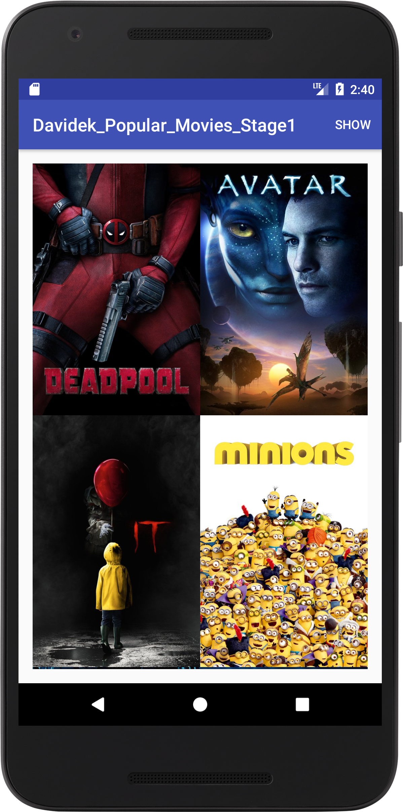
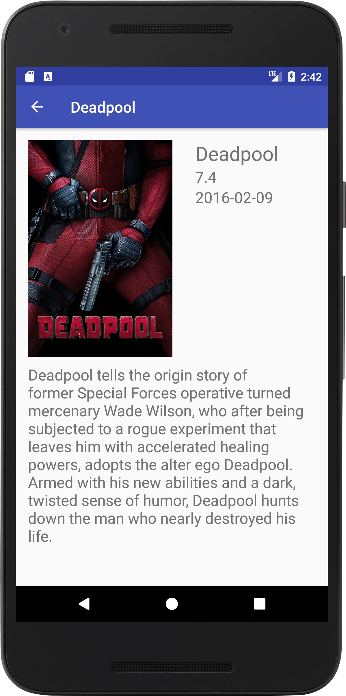
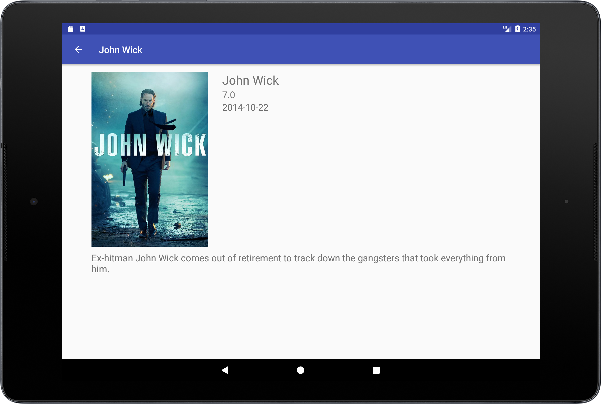

# PopularMoviesStage1
Simple movie listing Android app allowing users to discover movies. This is  a Project 1 of Udacity's Android Developer Nanodegree.
This app consits of 2 stages. You can find the second stage [here](https://github.com/DenisDavidek/PopularMoviesStage2).

## Features
- Discover top rated and popular movies
- Basic UI optimizations for phones and tablets

## Used Libraries inside this project
- [Picasso](https://github.com/square/picasso)

## Why this Project?
To become an Android developer, you must know how to bring particular mobile experiences to life. Specifically, you need to know how to build clean and compelling user interfaces (UIs), fetch data from network services, and optimize the experience for various mobile devices. You will hone these fundamental skills in this project.

By building this app, you will demonstrate your understanding of the foundational elements of programming for Android. Your app will communicate with the Internet and provide a responsive and delightful user experience.

# Screenshots

 </img>  </img>    </img>  
 </img>

# Developer Setup
Clone or download this repository and follow requirements and API KEY sections to get a successful build of this app.
## Requirements

 - Java 7
 - Latest version of Android Studio, Android Build Tools and Gradle
 
## API KEY

This app uses themoviedb.org API to get a releavant movie information and posters. 
You must provide your own [API Key](https://www.themoviedb.org/documentation/api) in order to build the app.

Create gradle.properties file and put your API key inside this file:

```
API_KEY="xYz123"
```

# Author

[Denis Dávidek](https://github.com/DenisDavidek)
